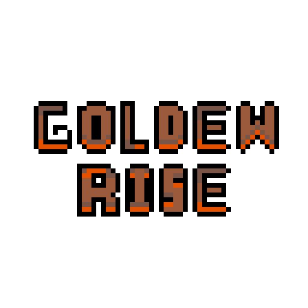
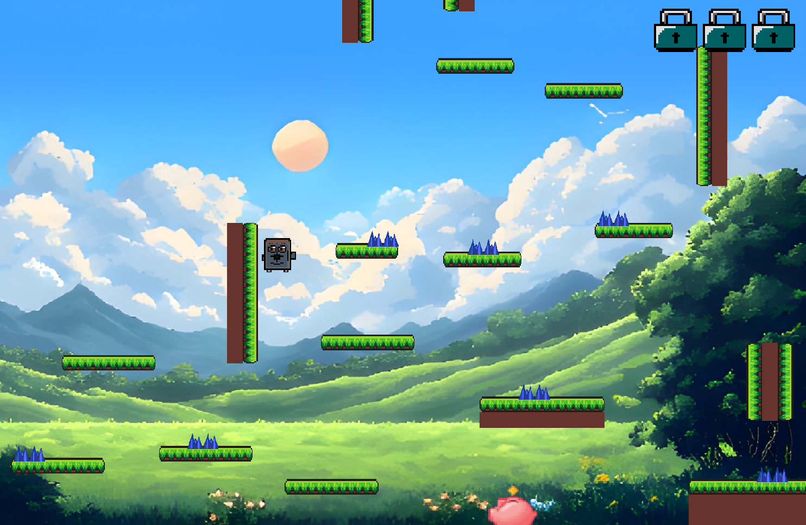
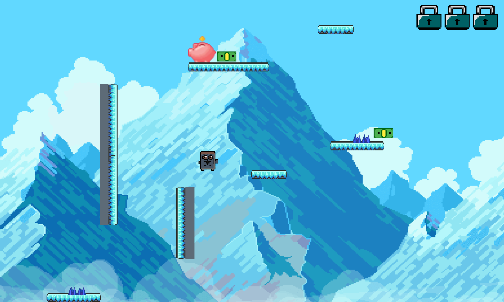
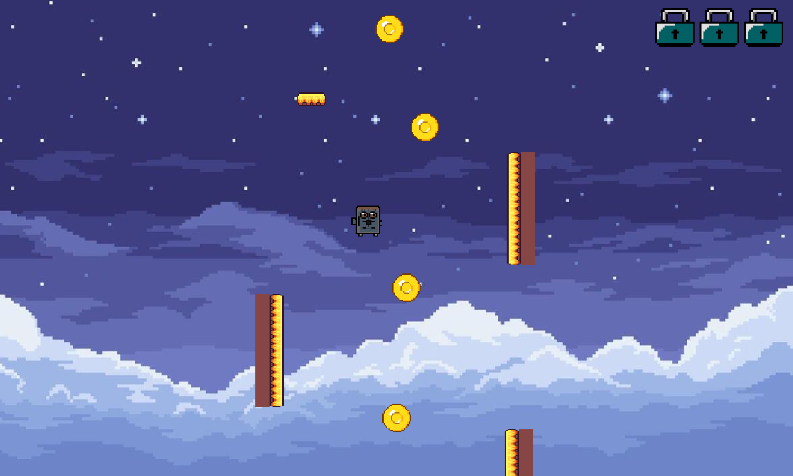
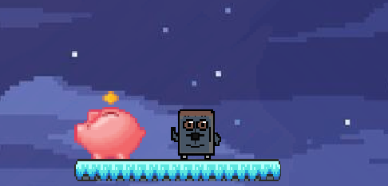

<center>
 
</center>

### Simple platformer game using C and Raylib made by a team of three.
<details>
<summary>Table of Contents</summary>

1. [About the Project](#about-the-project)
2. [Built With](#built-with)
3. [Gettting Started](#getting-started)
    - [Prerequisites](#prerequisites)
    - [Installation](#installation)
4. [Team](#team)
5. [License](#license)
6. [Contacts](#contacts)
</details>
<br>

# **About the Project**
<p>
This project was given as a task for one of our university classes so it was made in a short amount of time (14 days).The idea is a cross-platform 2d platformer that focuses on level-design, pixel graphics and movement depth.
</p>


<br>


<br>


<br>

<p align="right"><a href="#simple-platformer-game-using-c-and-raylib-made-by-a-team-of-three">(back to the top)</a> </p>

# **Built with**
- ### C programming language
- ### Raylib
- ### Ubuntu

<p align="right"><a href="#simple-platformer-game-using-c-and-raylib-made-by-a-team-of-three">(back to the top)</a> </p>

# Getting Started
<p>Instructions on setting up and running the project locally</p>

## Prerequisites
### 1. Build tools
- Linux
    ```
    sudo apt update
    sudo apt install build-essential git
    ```
- macOS
    ```
    xcode-select --install
    ```
### 2. System dependencies (Linux)

    sudo apt install libasound2-dev libx11-dev libxrandr-dev libxi-dev libgl1-mesa-dev libglu1-mesa-dev libxcursor-dev libxinerama-dev
### 3. Installing Raylib
    sudo apt update
    sudo apt install libraylib-dev
<p align="right"><a href="#simple-platformer-game-using-c-and-raylib-made-by-a-team-of-three">(back to the top)</a> </p>

## Installation
### 1. Clone the repository
    git clone https://github.com/Egor-Hrotskiy/golden-rise.git
### 2. Compile the game
    make
### 3. Launch the game
    ./endgame
### 4. Clean up
    make clean
<p align="right"><a href="#simple-platformer-game-using-c-and-raylib-made-by-a-team-of-three">(back to the top)</a> </p>

## Team

<table align="center" border="none">
  <tr>
    <td align="center" style="border: none;">
      <a href="https://github.com/sosonskyi1">
        
      </a>
    </td>
    <td align="center" style="border: none;">
      <a href="">
        
      </a>
    </td>
  </tr>
</table>
<p align="right"><a href="#simple-platformer-game-using-c-and-raylib-made-by-a-team-of-three">(back to the top)</a> </p>

## License
<p>Distributed under the MIT License. See LICENSE.txt for more information.</p>

## Contacts
#### Egor Hrotskyi - linkedin.com/in/egor-hrotskiy-4b228b3aa - egohtr@gmail.com
#### Project link: https://github.com/Egor-Hrotskiy/golden-rise#


<center></center>
<br>
<h3 align=center>Hope you enjoy it</h3>
<br>

<p align="right"><a href="#simple-platformer-game-using-c-and-raylib-made-by-a-team-of-three">(back to the top)</a> </p>